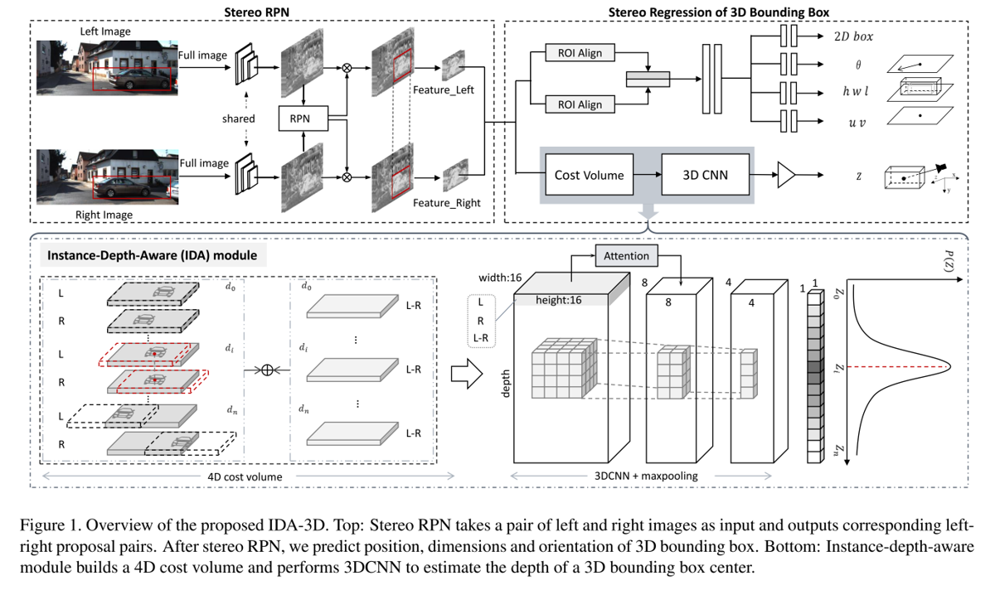

# IDA-3D: Instance-Depth-Aware 3D Object Detection from Stereo Vision for Autonomous Driving (CVPR2020)
This repository is the code for our CVPR2020 [paper](http://openaccess.thecvf.com/content_CVPR_2020/papers/Peng_IDA-3D_Instance-Depth-Aware_3D_Object_Detection_From_Stereo_Vision_for_Autonomous_CVPR_2020_paper.pdf)



## Installation
This implementation is based on the [maskrcnn-benchmark](https://github.com/facebookresearch/maskrcnn-benchmark), and you can check [INSTALL.md](https://github.com/facebookresearch/maskrcnn-benchmark/blob/master/INSTALL.md) for installation instructions.

We tested this code under python 3.7, PyTorch 1.1.0, CUDA 10.0 on Ubuntu 18.04. We also provide the off-the-shelf running environment based on [Singularity](https://sylabs.io/docs/) and [Anaconda](https://www.anaconda.com/). You can download directly from [here](http://pan.dlut.edu.cn/share?id=rzcyznsyacaz) and [here](http://pan.dlut.edu.cn/share?id=rweur3sy9rpw) and run the following commands.
```bash
unzip env_IDA3D.zip -d ~/anaconda3/envs/

# Activating Singularity and Anaconda environment
singularity shell --nv ubutu18-cuda10.simg
source ~/annconda3/bin/activate tdrcnn

# Installing apex
git clone https://github.com/NVIDIA/apex.git
cd apex
python setup.py install --cuda_ext --cpp_ext
# Note:The latest version of apex may not be compatible with our environment and you can download the old version from http://pan.dlut.edu.cn/share?id=rz5pdesya4i6

# Installing PyTorch Detection
git clone https://github.com/swords123/IDA-3D.git
cd IDA-3D
python setup.py build develop
```

## Training
We provide experiments on KITTI-3D benchmark. You can directly download our [processed dataset](http://pan.dlut.edu.cn/share?id=rw5cwssy9mi2) and place it into `IDA-3D/datasets/`. The data folder should be in the following format:
```bash
datasets
└── kitti
    ├── calib
    ├── image_2
    ├── image_3
    ├── label_2
    ├── label_3d
    └── splits
```
Activating Singularity and Anaconda environment, setting corresponding parameters from `./train.sh` and simply running:
```bash
./train.sh
```

## Evaluation
We provide the pretrained models for car category and you can download from [here](http://pan.dlut.edu.cn/share?id=rzk3vxsy9yg8). You can evaluate the performance using either our provided model or your trained model by setting correspondingand parameters from `./test.sh` and simply run:
```bash
./test.sh
```
Then, generating standard test files.
```bash
cd tools
python generate_results.py
```
Finally, running the evalutaion by:
```bash
./kitti_eval/evaluate_object datasets/kitti/label_2 self_exp/exp_1/kitti_test/result_xxx
```

## Acknowledgments
This repo is built based on the [maskrcnn-benchmark](https://github.com/facebookresearch/maskrcnn-benchmark).

## Citation
If you find this work useful for your research, please consider citing our paper:
```
@InProceedings{Peng_2020_CVPR,
    author = {Peng, Wanli and Pan, Hao and Liu, He and Sun, Yi},
    title = {IDA-3D: Instance-Depth-Aware 3D Object Detection From Stereo Vision for Autonomous Driving},
    booktitle = {IEEE/CVF Conference on Computer Vision and Pattern Recognition (CVPR)},
    month = {June},
    year = {2020}
} 
```

## License
Our code is released under [MIT license](LICENSE).
